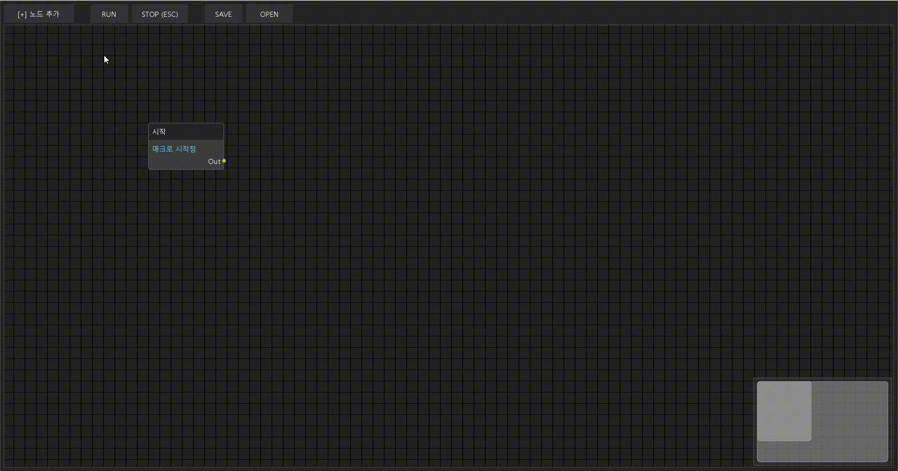
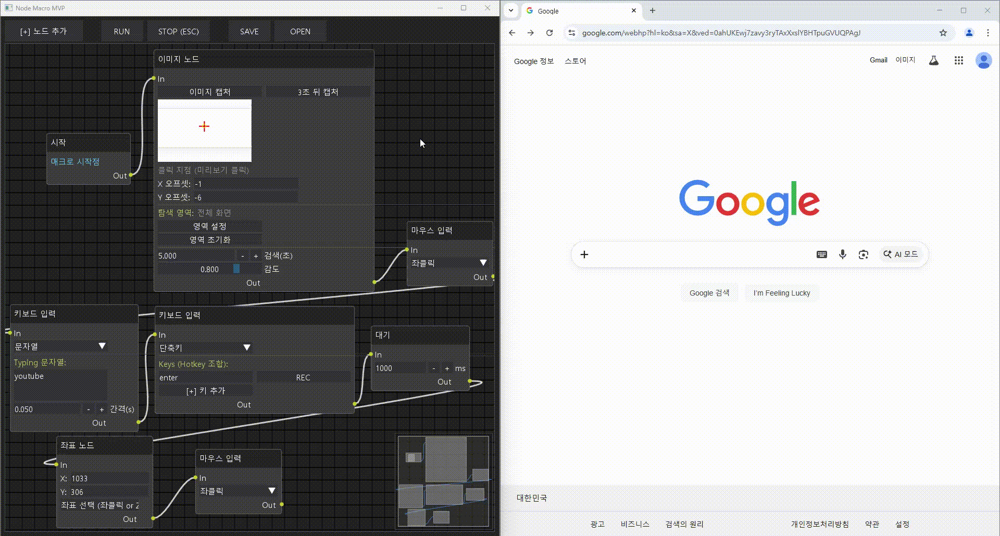
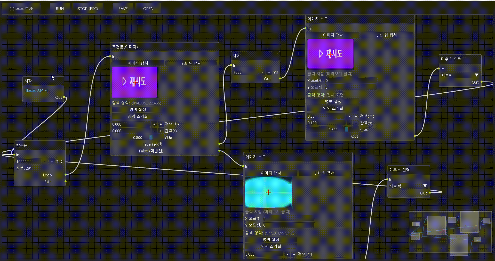
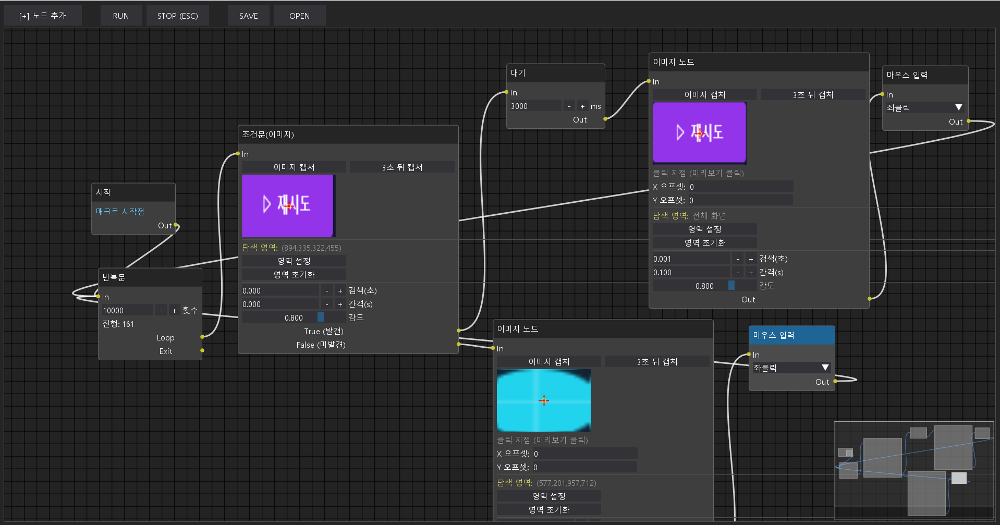

# Node-Based Automation Engine (NodeMacro)

---

## 프로젝트 소개 및 개발 배경

**NodeMacro**는 복잡한 코딩 없이 시각적으로 노드를 연결하여 자동화 워크플로우를 설계할 수 있는 **Python 기반 매크로 엔진**입니다.

기존의 단순 반복 매크로들은 수정이 어렵고 전체적인 흐름을 파악하기 힘들다는 단점이 있었습니다. 

본 프로젝트는 이러한 문제를 해결하기 위해 다음과 같은 목표를 가지고 개발되었습니다:

- **시각적 직관성**: 복잡한 실행 로직을 노드 그래프 형태로 시각화하여 한눈에 파악.
- **높은 확장성**: 새로운 동작(마우스, 키보드 등)을 모듈화된 노드 형태로 손쉽게 추가 및 세부 동작 제어 가능
- **지능형 자동화**: 이미지 인식과 조건부 분기를 결합하여 다양한 상황에 유연하게 대처하는 매크로 구축.

---

## 주요 기능

### 1. 노드 기반 워크플로우 설계
- 드래그 앤 드롭을 통한 노드 생성 및 연결.
- **시작, 입력, 동작, 제어** 탭으로 분류된 직관적인 노드 라이브러리.
- 마우스 위치 기반 노드 자동 배치 및 정밀한 복사/붙여넣기 시스템.

### 2. 지능형 이미지 인식
- **이미지 노드**: 화면 내 특정 이미지를 탐색하여 좌표를 획득.
- **영역 제한 검색**: 전체 화면이 아닌 특정 영역(`ROI`)만 탐색하여 성능 및 정확도 향상.
- **시각적 오프셋 보정**: 캡처된 이미지 내에서 실제 클릭 지점을 십자선으로 정밀 조정.

### 3. 정밀 제어 시스템
- **마우스**: 클릭(좌/우/더블), 이동, 드래그, 스크롤 지원.
- **키보드**: 단축키 조합(Hotkey) 및 문자열 타이핑 지원. 실시간 키 녹화 기능 포함.
- **흐름 제어**: 횟수 기반 반복(Loop), 이미지 존재 여부에 따른 조건부 분기(If-Else).

### 4. 에디터 편의 기능
- **데이터 영속성**: 설계된 워크플로우를 JSON 파일로 저장 및 로드.
- **패닉 스탑**: `ESC` 키를 통한 매크로 즉시 중단.

---

## 프로젝트 데모

### 📸 주요 화면

#### 메인 에디터 화면 및 조작

- 노드 에디터 인터페이스.
- 각 노드는 내부 수치를 조절하여 보다 정밀한 동작을 재현하는 것을 목표로 함.

#### 노드를 이용한 기본 매크로 동작

- 실시간 화면 캡처 및 인식, 마우스와 키보드 조작 기능

#### 조건문을 사용한 자동 에임 트래킹 시연

- 해당 시연의 노드 구성
- 반복문 내에서 재시도 버튼이 존재하는지를 조건문(if) 로 체크하고, 
false(존재하지 않을 시) 과녘 이미지를 찾아 우클릭,
true(존재할 시) 3초 뒤 해당 버튼을 눌러 재시도.
- 단순 사용자의 행동을 위치와 시간 기반으로 모방하는 매크로는 이 시연이 불가능하지만,  본 프로젝트는 설정한 판단 기준에 따라 유연한 작업 수행이 가능함.

---

## 기술 스택

### Language & Core
- **Python 3.10+**: 유연한 스크립팅과 풍부한 자동화 라이브러리 활용.

### GUI Framework
- **Dear PyGui**: C++ 기반의 GPU 가속 프레임워크를 사용하여 대규모 노드 그래프에서도 퍼포먼스 유지.

### Automation & Logic
- **PyAutoGUI**: 크로스 플랫폼 마우스/키보드 제어.
- **Pynput**: 전역 키보드 리스너를 통한 매크로 중단(Panic Stop) 구현.
- **OpenCV / NumPy**: 고성능 템플릿 매칭 알고리즘 기반 이미지 인식.

---

## 아키텍처

### 핵심 설계 원칙 (Design Principles)
- **Registry Pattern**: `NODE_MAP`을 통한 노드 등록 시스템으로 새로운 기능 추가 시 기존 코드 수정을 최소화 (OCP 준수).
- **Abstract Base Classes**: `BaseNode` 및 `BaseImageNode` 추상화를 통해 공통 UI 로직과 이미지 처리 로직을 중앙 집중화.
- **Multi-threading**: UI 메인 루프와 매크로 실행 엔진을 분리하여 실행 중에도 UI 응답성 유지.

---

## 주요 문제 해결 과정

### 1. 에디터 시점 변화에 따른 좌표 불일치 해결
- **문제**: 노드 에디터에서 패닝한 상태에서 새로운 노드를 추가하거나 붙여넣을 때, 마우스 위치와 실제 노드 생성 좌표가 일치하지 않는 현상 발생.
- **해결**: 에디터 내부에 보이지 않는 원점 참조용 앵커 노드를 배치. 마우스의 화면 좌표와 앵커의 화면 좌표 간의 차이를 계산하여 **캔버스 상대 좌표**를 역산하는 알고리즘 구현.
- **결과**: 어떤 시점에서도 마우스가 위치한 정확한 지점에 노드를 배치할 수 있게 되어 UX를 크게 개선.

### 2. 실행 중 UI 프리징 방지 및 비상 중단 구현
- **문제**: 매크로 실행(대기 시간, 이미지 검색 등)이 메인 스레드에서 동작할 경우 전체 UI가 멈춰버려 중단 버튼조차 누를 수 없는 상황 발생.
- **해결**: `threading` 모듈을 사용하여 실행 엔진을 별도 스레드로 분리. `pynput` 전역 리스너를 연동하여 스레드 외부에서 안전하게 실행을 중단시키는 **패닉 스탑** 시스템 구축.
- **결과**: 매크로 실행 중에도 실시간 로그 확인 및 상태 모니터링이 가능하며, 긴급 상황 시 즉각적인 제어권 확보 가능.

### 3. 하드코딩된 노드 관리 로직 리팩토링
- **문제**: 프로젝트 초기, 노드를 저장/로드/복사할 때마다 각 노드 타입을 `if/elif` 분기문으로 처리하여 새로운 노드 추가 시 4개 이상의 파일을 동시 수정해야 하는 유지보수 결함 발생.
- **해결**: 노드 클래스 자체에 `node_type` 식별자를 부여하고, **중앙 집중식 레지스트리(`NODE_MAP`)**를 도입. 모든 로직이 레지스트리를 참조하여 동적으로 처리되도록 개선.
- **결과**: 신규 노드 추가 시 클래스 정의와 레지스트리 등록만으로 모든 기능이 자동 연동되는 확장 가능한 구조 확보.

## 추후 개발 계획

- ui상으로만 존재하는 마우스 입력 구현(드래그, 스크롤 등)
- 더욱 정교한 제어를 위한 변수 및 연산 노드 추가
- 스크립트 자체의 노드화로 인한 재사용성 향상
- ui의 가시성 향상 및 편의성 증대
- 매크로 실행 파일 생성 기능