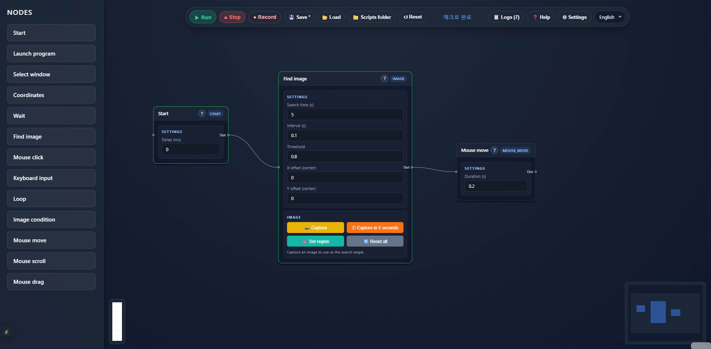
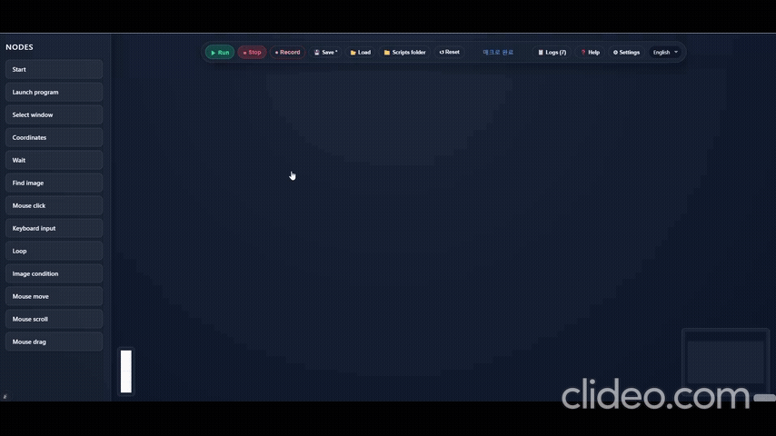
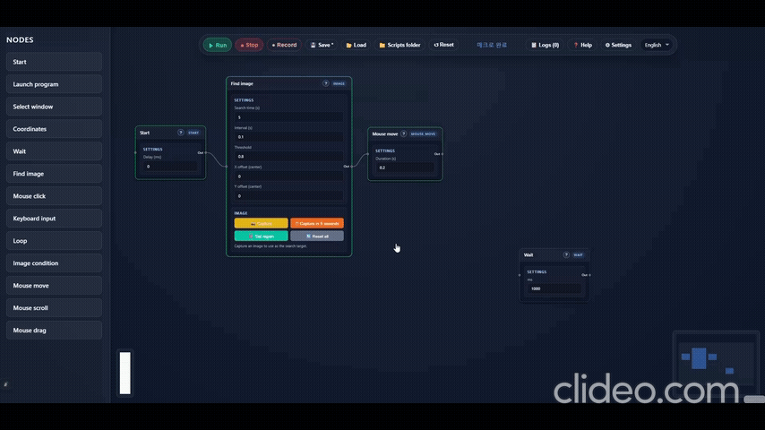
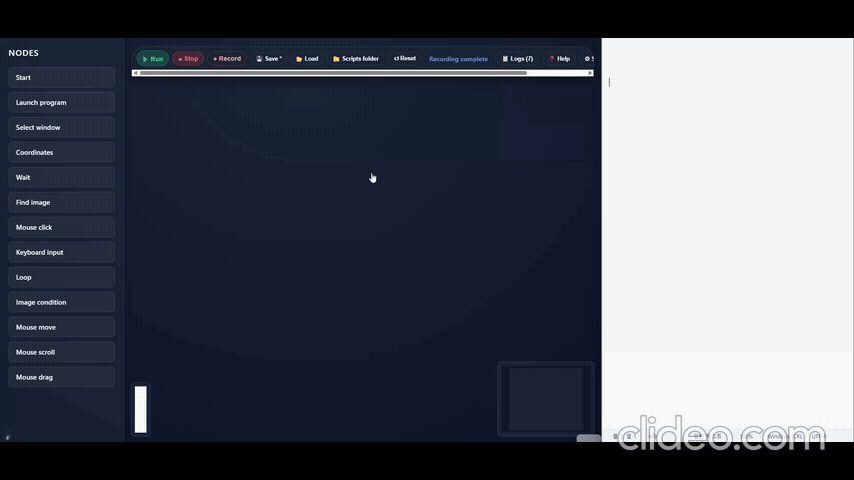
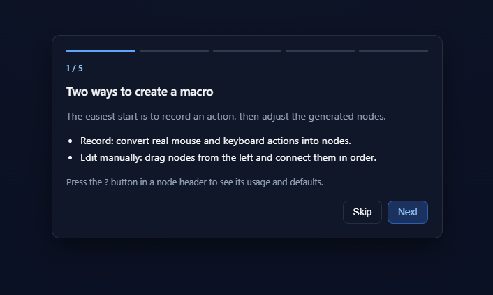

# D5 Macro

Build custom Windows macros visually—no coding required. D5 Macro is a local
automation tool published by `d051c`.

> **Status:** Version 1.0.5 release candidate for Windows 10/11 x64. This
> repository is public for portfolio review, security review, and source
> availability corresponding to official binaries. Public source access does
> not grant commercial use or redistribution rights. See [LICENSE](./LICENSE).



## Features

- Visual node-based editor
- Mouse and keyboard automation, with image matching, conditions, loops, and
  window-relative actions for multi-step workflows
- Multi-monitor support
- Live execution status and logs
- Save and load reusable scripts, with optional one-click launcher batch files
- Korean and English interface

Incremental usability and reliability updates are planned after release.

## See it in action

### Create and connect nodes



### Capture an image, find it, and move the cursor



### Record typing in Notepad and replay it



### Built-in tutorial



## Installation

Run `D5Macro-Setup-<version>.exe`, then open **D5 Macro** from the Start menu
or desktop shortcut. Python and Node.js are not required. The app can be
reopened or closed from the system tray.

Until an Authenticode-signed installer is published, Windows SmartScreen may
show an unknown publisher warning. Only use an installer from the official
release or purchase page, and verify its published SHA-256 checksum. Do not
run macro JSON or batch files from untrusted sources.

User data is stored separately from the application:

```text
Documents\D5Macro\scripts    Macros and saved images
%LOCALAPPDATA%\D5Macro       Settings, logs, and temporary captures
```

The uninstaller asks whether to remove user data and preserves it by default.

## Quick start

1. Open D5 Macro and follow the built-in tutorial.
2. Drag nodes from the left panel and connect them in execution order, or
   press **Record** to convert real input into editable nodes.
3. Press **Run** and switch to the target application.
4. Use the configured emergency stop key if an action targets the wrong place.

Press the `?` button in a node header to see its behavior and defaults.

## Recording

1. Press **Record** and switch to the target application before the countdown
   ends.
2. Perform the mouse and keyboard actions to reproduce.
3. Press the configured recording stop key (F8 by default).
4. Apply the result, inspect the generated nodes, and test it safely.

Recording replaces the current graph. Use `Ctrl+Z` to restore the previous
graph. Cursor movement is stored as compact movement sequences rather than a
large number of individual nodes.

## Window-relative coordinates

1. Enter part of the target window title in a **Select window** node.
2. Enable **Window-relative coordinates** in a coordinate-based node.
3. X/Y values are calculated from the target window's top-left corner.

This keeps actions aligned when the window moves to another position or
monitor. Dynamic titles such as document names are matched using their stable
portion.

## Direct script launch

Enable **Create launcher batch file** when saving a macro to create:

```text
scripts/<name>/
├── <name>.json
├── <name>.bat
└── imgs/
```

Opening the batch file starts D5 Macro if needed, reuses it if already running,
and executes the saved macro.

## Supported nodes

- Start, launch program, select/wait for window, coordinates, and wait
- Find image and image condition
- Mouse click, movement sequence, scroll, and drag
- Keyboard input and loop

## Development

Python 3.11 and Node.js 22.12 or later are required.

```powershell
pip install -r requirements.txt
cd frontend
npm ci
npm run build
python ../launcher.py
```

The editor opens at <http://127.0.0.1:8000>. The server binds only to
`127.0.0.1`.

## Build

```powershell
pip install -r requirements-build.txt
.\build.ps1
```

PyInstaller output is written to `dist\D5Macro`. If Inno Setup `iscc` is
available, the installer is written to `release`. Commercial releases should
sign both the application and installer with the same Authenticode certificate.

## Project structure

```text
backend/   FastAPI API, execution engine, and automation nodes
frontend/  React, Vite, and React Flow editor
branding/  Application icons
installer/ Inno Setup definition
imgs/      Current product screenshots and demonstrations
```

## Privacy, security, and licensing

- The app uses no remote account, advertising, or telemetry service.
- Macros, captures, settings, and logs remain on the user's computer.
- Saved macro JSON and generated batch files can launch programs and reproduce
  input, so treat them like executable files.
- Review [Privacy](./docs/PRIVACY.md), [Security](./SECURITY.md),
  [Third-party notices](./docs/THIRD_PARTY_NOTICES.md), and
  [LGPL compliance](./docs/LGPL_COMPLIANCE.md) before distribution.
- Official binary source is preserved using matching version tags.

D5 Macro automates user-defined input. Test macros in a safe environment and
do not use the software to bypass service rules, anti-cheat systems, access
controls, or applicable law.

The D5 Macro application code is **source-available** for portfolio and release
transparency. Commercial use, resale, and redistribution require separate
permission. Third-party components remain under their respective licenses.

## Contact

Questions and support: [yanche2990@gmail.com](mailto:yanche2990@gmail.com)
