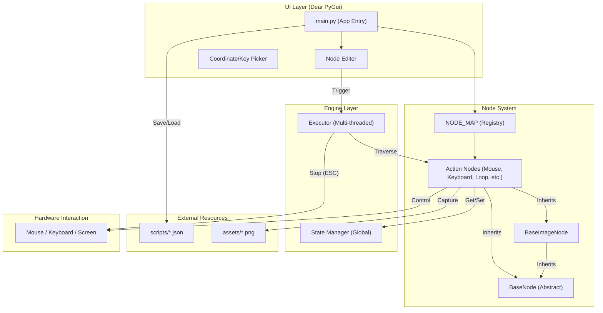
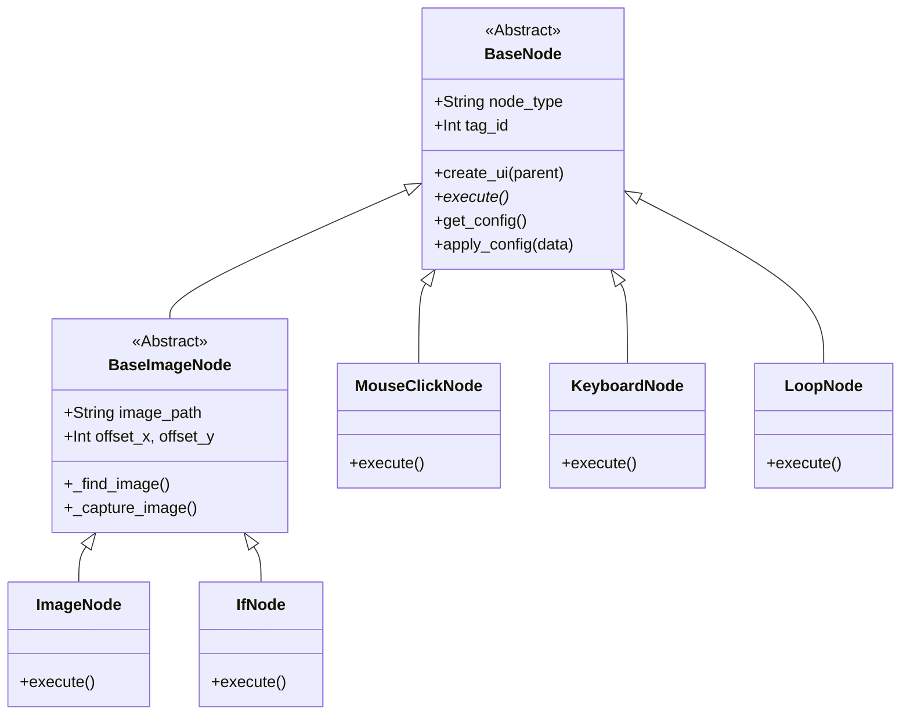
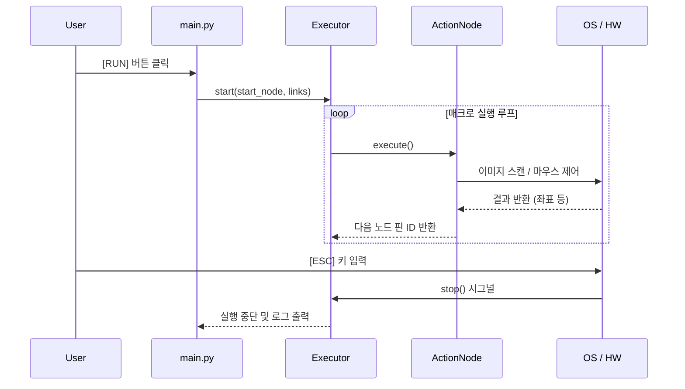

# 시스템 아키텍처 (System Architecture)

본 문서는 **NodeMacro Engine**의 내부 구조와 컴포넌트 간의 상호작용을 Mermaid 다이어그램으로 설명합니다.

## 1. 전체 구조도 (High-Level Overview)

---

## 2. 노드 클래스 계층 구조 (Class Hierarchy)

---

## 3. 실행 흐름 (Execution Flow)

---

## 💡 기술적 특징 설명

1.  **Registry Pattern**: `NODE_MAP`을 사용하여 노드 타입을 중앙 관리함으로써, `main.py`의 수정 없이도 새로운 노드를 손쉽게 확장할 수 있습니다.
2.  **Multi-Threading**: 매크로 로직이 별도의 스레드에서 동작하므로, 이미지 검색이나 긴 대기 시간 중에도 UI가 응답 불능 상태에 빠지지 않습니다.
3.  **Coordinate Transformation**: 앵커 노드를 기준으로 하는 좌표 역산 알고리즘을 통해 에디터의 줌/패닝 상태와 관계없이 정확한 위치에 노드를 배치합니다.
